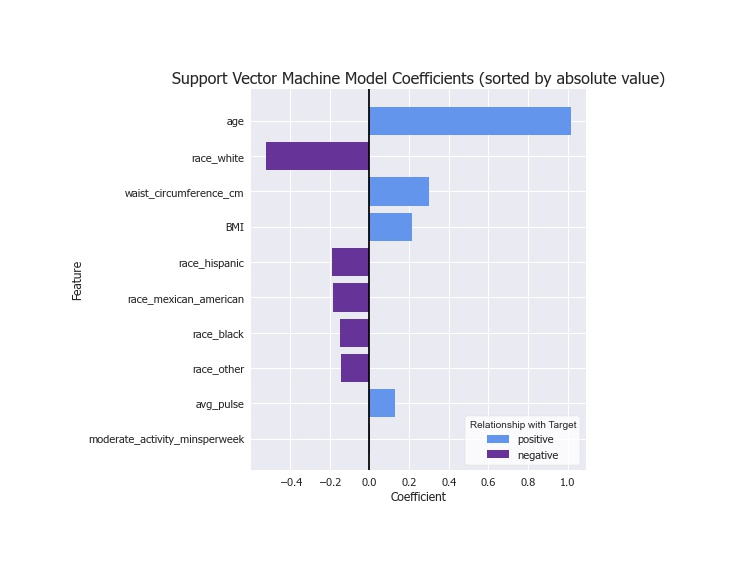

# Predicting Diabetes Without Lab Tests

## Supervised Learning Classification Model

Kristin Cooper | DTSC-FT-022221 | Instructor: James Irving


## Problem:

According to the American Diabetes Association, diabetes was the 7th leading cause of death in the US in 2015. More than 30 million Americans - 10.5% of the population - are living with diabetes. Another 86 million Americans are living with prediabetes, which increases their risk of developing Type 2 diabetes and other chronic conditions.

As of 2017, diagnosed diabetes wass estimated to cost upwards of $327 billion annually - and this is a drop in the bucket of the cost of caring for Americans with chronic conditions. This hurts both the system and the individual; people diagnosed with diabetes on average spend 2.3 times as much on medical expenditures than people without this diagnosis.

A clear problem facing individuals, the healthcare system, and society at large, diabetes prevention and care is the subject of many health-related programs invested in by a variety of stakeholders. A few examples include:

- Public health agencies seek to improve the health and wellness of the communities they serve through locally-based programs improving access to healthy foods and health education.
- Insurance companies incentivize preventive care in order to reduce lifetime cost of their members by reducing hospitalizations and treatments associated with unmanaged conditions.
- Employer benefits coordinators provide employees with health & wellness benefits to keep them healthy, happy, and productive. 
- Health and wellness companies like Virta Health and Omada, stimulated by increased consumer adoption of digital health solutions, build entire businesses around their care management platforms, partnering with stakeholders across the healthcare system to capitalize on the gains associated with a healthier society.

## Purpose:

This report seeks to predict the presence of diabetes or prediabetes using only survey-based data and simple body measurements.

Using this model, stakeholders with diabetes prevention and management programs can target outreach, advertisement, and investment to individuals most likely to benefit from their programs. This model should **not** be used in place of physician advice and care plans.


## Data:

A subset of the CDC's 2017-2018 National Health and Nutrition Examination Survey [(NHANES)](https://www.cdc.gov/nchs/nhanes/about_nhanes.htm) data was used to calculate a diabetes/prediabetes diagnosis based on A1C levels, then train and test models to predict diagnoses using only demographic info, surveys, and simple body measurements. 

Sample size: 5,951, split 80/20 into train and test samples.
Feature size: 37 total predictors comprised of demographic, physical activity, nicotine usage, and health insurance survey data as well as body measures (height, weight, waist circumference, hip circumference) and pulse were modeled

## Approach:

This is a binary classification supervised machine learning model. 

Target classes: Diabetic/Prediabetic (1) or Normal (0)
Target classes were calculated based on measured A1C levels using the [Mayo Clinic’s guidance](https://www.mayoclinic.org/diseases-conditions/diabetes/diagnosis-treatment/drc-20371451#:~:text=A%20fasting%20blood%20sugar%20level,separate%20tests%2C%20you%20have%20diabetes.): A1C level >6.5 indicates diabetes, >5.7 and <6.5 indicates prediabetes, and <5.7 indicates normal blood sugar health.

Preprocessing steps included:
- Unencoding survey data and left-merging to A1C lab results
- One-hot encoding categorical variables
- Train-test split with 20% test size
- [Scikit-learn's experimental IterativeImputer class](https://scikit-learn.org/stable/modules/generated/sklearn.impute.IterativeImputer.html) used to intelligently fill some missing data
- [Imbalanced-learn's SMOTE class](https://imbalanced-learn.org/stable/references/generated/imblearn.over_sampling.SMOTE.html) to balance the training sample's target class split
- Scikit-learn's StandardScaler class to normalize data


Modeling techniques included:
- Logistic Regression with Cross-Validation
- K-Nearest Neighbors
- Decision Trees, Bagged Trees, and Random Forest
- Boosting Ensemble Methods including AdaBoost, GradientBoost, & XGBoost
- Support Vector Machine
- Grid Search


## Evaluation

The primary metric used to evaluate this particular model is the **Recall Score**, which represents *out of all the true diabetic/prediabetic people, how often did the model predict the correct diagnosis?* 

Consequences for predicting a diabetic/prediabetic person is healthy are significant. Individuals may miss out on the program, leading to lower quality of life, greater personal health expenses, and possible premature loss of life. Stakeholders' programs have less impact on their target metrics, leading to lower return on investment.


## Results:

Based on the sample data, the best models consistently perform better than random chance and simple stratification models.

The maximum recall scores across all models is consistently around .75-.8, meaning **75-80% of true diabetic/prediabetic diagnoses are correctly predicted by the model.**  

The best performing models resulted in between **8.5-9.5% false negatives**, or diabetics who were incorrectly predicted to be healthy.

The highest accuracy scores are consistently between .71 and .76, indicating that **the model predicts the correct diagnosis about 71-76% of the time.**

Best model's performance:


Models generated coefficients for each feature, which give insight into the risk factors observed by the models.

The importance of the feature to the model’s predictions is measured by the absolute value of the coefficient. Coefficients near zero are not used much by the model.

Positive coefficients indicate the feature has a positive relationship with diagnosis. As the feature value increases, the probability of a diabetes diagnosis also increases.

Negative coefficients indicate the features has a negative relationship with diagnosis. As the feature value increases, the probability of a diabetes diagnosis decreases.


Best model's coefficients:



## Model Limitations:

- Coefficients represent observed relationships of a relatively small sample and should not be considered causal. There are countless factors that influence a person's health such as family history, living environment, and many more.

- This model is not intended to predict diabetes in children under 18 or pregnant women.

- This model was trained on a sample comprised only of individuals in the USA. Some data, notably insurance coverage status, is quite specific to this sample.


## Next Steps & Future Enhancements:

The model as-is can be used immediately to target outreach, advertisement, and investment in preventative care, social determinants of health, health & wellness, and health literacy programs. This model should **not** be used in place of physician advice and care plans.

Future enhancements:
- Add samples to training set to improve performance.
- Create a multivariate classifier to differentiate between prediabetes and diabetes.
- Incorporate time-series using data from prior year NHANES.


### For further information:
Please review the full report in [this jupyter notebook](./report.ipynb) or review the non-technical [presentation](./presentation.pdf)

For any additional questions, please contact kcoop610@gmail.com.


#### Repository Structure:

```

├── README.md            
├── report.ipynb           
├── presentation.pdf    
└── images
    └── images              
└── data
    └── 11 .xpt data files from NHANES
└── styles
    └── custom.css 
 

```
